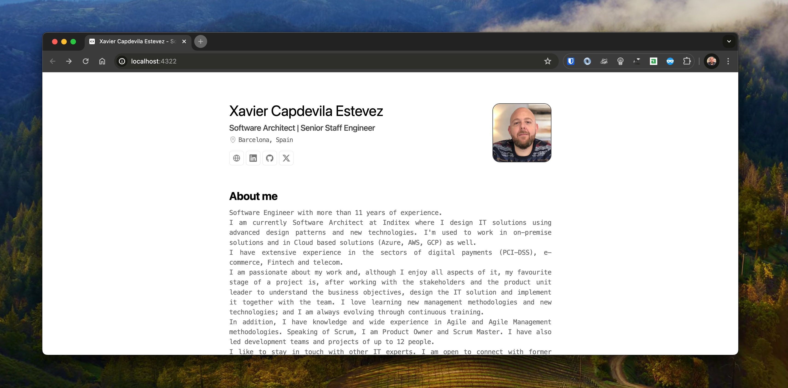

 

<h2>
    Minimalist <em>Résumé</em> optimised for web and pdf.
</h2>

Based on the <a href="https://github.com/midudev/minimalist-portfolio-json">Miguel Ángel Durán</a> template.

Basado on the <a href="https://github.com/BartoszJarocki/cv">Bartosz Jarocki</a> design.

CV structure based on <a href="https://jsonresume.org/schema/">jsonresume.org</a>. (*) <em>Some modifications have been made, please check [cv.json](resources/cv.json).</em>

    <a href="#🚀-start">
        Start
    </a>
    &nbsp;✦&nbsp;
    <a href="#🛠️-stack">
        Stack
    </a>
    &nbsp;✦&nbsp;
    <a href="#🧞-commands">
        Command
    </a>
    &nbsp;✦&nbsp;
    <a href="#🔑-license">
        License
    </a> 

</img>

## 🚀 Start

### How to Use This Project

This project is designed to be simple and easy to use. All you need to do is fill the `cv.json` file with your data. 

The `cv.json` file is where you'll input all of your CV information. This includes your name, contact information, skills, work experience, education, and any other relevant details. The file is structured in a way that makes it easy to input your information. 

Once you've filled out the `cv.json` file, the project will automatically generate a CV based on the data you've provided. This makes it easy to keep your CV up to date and ensures that the format is consistent and professional.

To get started, simply clone the project, open the `cv.json` file, and start inputting your information. Once you're done, save the file and the project will take care of the rest.

### Utils

🎨 [Skills Icons](https://icon-sets.iconify.design/foundation/?license=MIT)

## 🛠️ Stack

- [**Astro**](https://astro.build/)
- [**Typescript**](https://www.typescriptlang.org/)
- [**Ninja Keys**](https://github.com/ssleptsov/ninja-keys) - Keyboard shortcuts interface for your website. Working with static HTML, Vanilla JS, Vue, React, Svelte.

## 🧞 Commands

|     | Command          | Notes                                        |
| :-- | :--------------- | :-------------------------------------------- |
| ⚙️  | `dev` o `start` | Starts a local webserver on `localhost:4321`.  |
| ⚙️  | `build`          | Checks errors and makes a production build of the project under `./dist/`.      |
| ⚙️  | `preview`        | Preview on `localhost:4321` |

Open [**http://localhost:4321**](http://localhost:4321/) in your browser to check it out 🕵🏻.

## 🔑 License

[MIT](LICENSE.txt) - Created by [**xcapdevila**](https://xcapdevila.github.io/).
